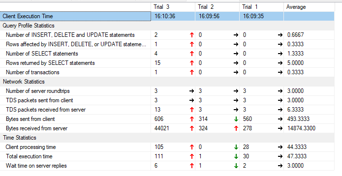

Los procedimientos almacenados son ideales para operaciones que involucran múltiples pasos, manipulación de datos, y transacciones complejas.Se opta por hacer un procedimiento almacendado para automatizar la insercion de citas medicas en la tabla de Cita, a modo de evitar errores en el ingreso de datos de forma manual, garantizando la integridad de datos al momento del registro. Basicamente, la eleccion se justifica en la complejidad de la operacion ya que involucra multiples pasos.
Este procedimiento recibe los parámetros necesarios para crear una nueva cita: fecha, motivo, número de matrícula del médico, número de paciente y número de documento.
Inicia una transacción para garantizar que la inserción sea atómica, es decir, que ocurra completamente o no ocurra en absoluto.
Valida la existencia de medico y paciente antes de realizar la insercion.
Si las validaciones son exitosas, se inserta una nueva cita en la tabla Cita.
Si ocurre un error durante el proceso, se hace un ROLLBACK de la transacción.Se captura y lanza un mensaje de error si falla.

La eleccion de una funcion almacenada se opta porque estas son más adecuadas para operaciones que devuelven un valor o un conjunto de datos, y que no modifican el estado de la base de datos.En este caso se usa para consultar la cantidad de citas de un medico espeficico.
Acepta el número de matrícula del médico, la fecha de inicio y la fecha de fin para definir el rango. Busca en la tabla Cita todas las citas asociadas al número de matrícula del médico proporcionado y devuelve una tabla con las citas encontradas.

Comparando la ejecucion de un procedimiento almacenado en comparacion a una consulta insert arrojo que:
El costo relativo(relative to the batch) de la query para realizar el insert sin el procedimiento almacenado fue de un 100%.

la operacion llevo un Wait Time on Server Replies: 2.75 ms. Client Processing Time: 47.25 ms. Total Execution Time: 50 ms.

En cambio el costo relativo del procedimiento almacenado fue de un 80%, aunque tuvo un 20% de costo para verificar si una droga existia en la tabla drogas.

Ademas Tambien podemos observar que la operacion llevo un Wait Time on Server Replies: 3 ms, tiempo de espera del motor para recibir la respuesta del servidor. Client Processing Time: 44.33 ms, tiempo que el motor tomó para procesar la información recibida del servidor. Total Execution Time: 47.33 ms, incluye la ejecución en el servidor, la transferencia de datos, y el procesamiento en el cliente, Es el tiempo que le lleva al usuario recibir la informacion.

Podemos observar asi que el procedimiento alamcenado presento una ganancia de 2.77ms en el tiempo total de execucion, demostrando asi la ventaja de utilizarlo por sobre una consulta dml normal. Ya que se nota la rehusabilidad del codigo y una mejora en el tiempo en relacion cliente-servidor.
